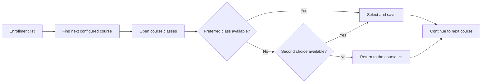

<div align="center">

# InforEstudante Enrollment Bot

**A local visual automation assistant for selecting course schedules in the University of Coimbra student portal.**

Experimental · Python · Windows desktop automation

</div>

> [!IMPORTANT]
> This project controls the mouse and can submit real enrollment changes. Keep the browser visible, supervise every run, and validate the workflow before using it during a live enrollment period.

## Overview

InforEstudante Enrollment Bot automates the repetitive steps involved in choosing classes on the University of Coimbra's InforEstudante portal. It recognizes configured areas of the interface, opens each selected course, attempts the preferred class, falls back to a second choice when available, and saves the selection.

The bot works entirely through the visible browser interface. It uses the browser session that is already open and authenticated; it does not store portal credentials or communicate directly with a private API.

Although this is an OCR-style automation workflow, the current implementation uses visual template matching rather than text extraction. Its accuracy therefore depends on the page looking like the reference material used to configure it.

## Features

- Processes courses in a configurable priority order.
- Supports a preferred and second-choice class for each course.
- Offers a visual dry-run with a separate annotated desktop viewport.
- Recognizes both practical/laboratory and theoretical-practical course pages.
- Uses a global Caps Lock shortcut to start or request a stop.
- Runs locally against an existing authenticated browser session.
- Keeps personal credentials outside the project.

## How it works



At startup, the script loads the configured course references and sorts them alphabetically. This makes their filenames the priority mechanism. Each course reference maps to a primary class reference with the same identifier and may also have a fallback variant ending in `-2`.

The current configuration contains four course targets, each with a primary and fallback class selection.

## Requirements

- Windows with an interactive desktop session
- Python 3
- An already authenticated InforEstudante browser session
- A browser window whose zoom, dimensions, and page layout match the configured visual references

Install the Python packages used by the current implementation:

```powershell
python -m venv .venv
.\.venv\Scripts\python.exe -m pip install -r requirements.txt
```

The dependency versions reflect the environment used for the current static and visual checks.

## Configuration

The configuration is based on small visual references captured from the portal:

- `cadeiras/` contains the course references and determines processing order.
- `turmas/` contains the corresponding preferred and fallback class references.
- `exemplos/` contains sample configuration material and is not loaded by the bot.
- `assets/ui/` contains the shared interface references used to recognize pages and controls.

Use a short shared identifier for each course and its class references. Prefix course identifiers alphabetically to define priority. Add `-2` to a class identifier when a second choice should be attempted.

Capture tightly cropped, stable interface elements at the same browser zoom and Windows display scaling that will be used during enrollment. Avoid including names, student numbers, photographs, or other personal information in configuration assets.

The script resolves its configuration relative to its own location, so it can be launched from another working directory. It validates the shared references and every primary class mapping before registering the hotkey. Restart it after changing the configuration.

## Usage

1. Sign in to InforEstudante manually.
2. Open **Inscrições em Turmas → Lista Inscrições**.
3. Keep the browser fully visible and arranged like the configured reference layout.
4. Start in dry-run mode, which is also the default:

```powershell
.\.venv\Scripts\python.exe bot.py --mode dry-run
```

5. Press **Caps Lock** to exercise course navigation and class selection. When the final Save control is reached, dry-run reports the action, skips the click, and returns to continue with the next course.
6. To watch what the bot recognizes and intends to select, use visual mode:

```powershell
.\.venv\Scripts\python.exe bot.py --mode visual
```

Visual mode remains a dry-run. It opens a companion viewport, preferably on a secondary display, and shows the latest primary-display capture with the detected page marker, course, action control, class choice, or final Save target outlined and labelled. The viewport hides before every new capture so its own contents cannot interfere with recognition.

7. After validating the complete dry-run flow, explicitly enable submission when required:

```powershell
.\.venv\Scripts\python.exe bot.py --mode live
```

8. Press **Caps Lock** again to request a stop, or **Ctrl+C** in the terminal to exit the listener.

Do not switch windows, change browser zoom, scroll manually, or cover the browser while a sequence is running.

## Current limitations

This is a proof of concept built around a specific portal layout. The current implementation:

- performs one pass through the configured courses;
- depends on fixed screen regions, scroll distances, confidence thresholds, and timing;
- captures and visualizes only the primary display; place the browser there before starting;
- cannot distinguish every recognition failure from an unavailable class;
- assumes the portal returns to the expected page after saving;
- enables the final Save click only in explicit live mode and does not verify that the portal accepted it;
- has no dedicated server-outage detection or recovery; if InforEstudante becomes unavailable mid-run, it may time out, wait indefinitely on an unexpected page, or continue without knowing whether the last submission was accepted;
- may wait indefinitely for the enrollment list in some failure paths;
- uses a cooperative stop flag that does not immediately interrupt an active screen operation;
- has no automated browser test suite.

If the portal becomes unavailable, stop the automation, wait for service to recover, verify the current enrollment state manually, return to the enrollment list, and only then start a new run.

Review these constraints before unattended use. See the [technical code review](docs/reviews/2026-09-08-code-review.md) for detailed findings and recommended corrections.

## Verification

Run the local safety and configuration checks with:

```powershell
.\.venv\Scripts\python.exe -m unittest discover -s tests -v
```

These tests verify the safe default, visual and live selectors, row-local control searches, viewport handoff, the final-click boundary, and script-relative reference resolution using mocked desktop controls. They do not operate the mouse or validate the live portal.

## Project structure

```text
.
├── bot.py                  # Automation entry point
├── ui/viewport.py          # Separate annotated visual diagnostics
├── requirements.txt        # Reproducible Python dependencies
├── assets/ui/              # Shared interface references
├── cadeiras/               # Ordered course references
├── turmas/                 # Preferred and fallback class references
├── exemplos/               # Inactive configuration examples
├── tests/                  # Local safety and configuration checks
└── docs/reviews/           # Technical review records
```

## Project status

The repository is currently an experimental personal automation project. Visual recognition has been checked against representative portal pages. A complete live enrollment run and confirmation of persisted selections remain unverified.

Last updated: 2026-09-08
